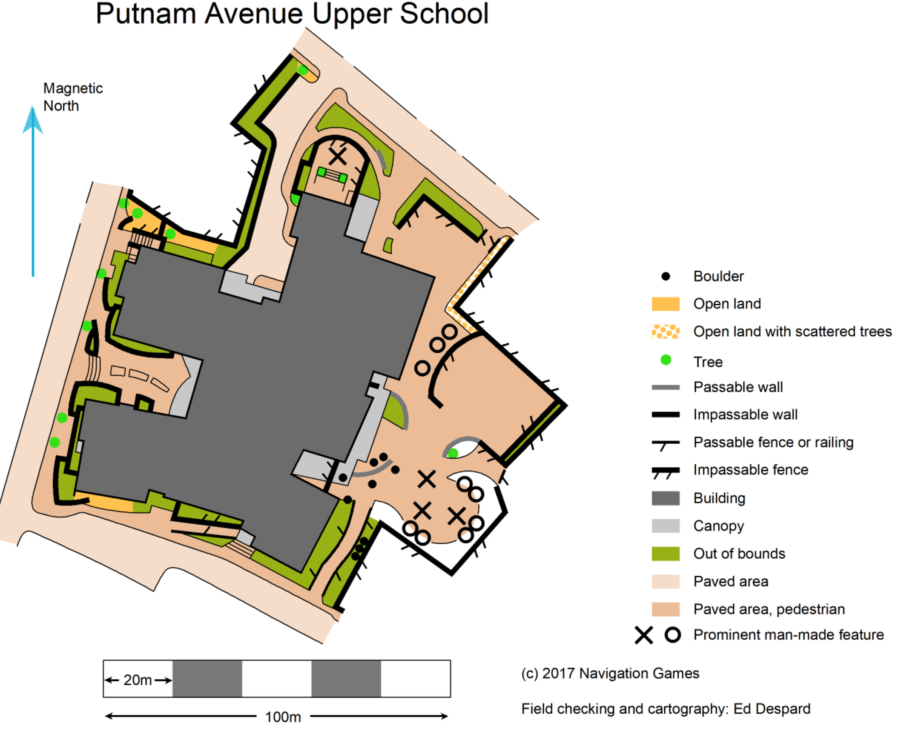

# Youth Mapping Program Manual

This documentation supports OUSA's Youth Mapping Program.

It includes the following sections:

* [Overview of the program](the-youth-mapping-program/overview-of-the-program.md)
* [Information for mappers](for-mappers/contents-mapper-guidelines.md)
* [Information for schools and youth organizations](for-schools-and-youth-organizations/untitled.md)
* [Information for the Youth Mapping Committee](for-the-ymp-committee/untitled.md)

This book was created with GitBook. We love GitBook. It is an easy way to create beautiful documentation online; GitBook hosts the documentation; there is a nice integration with GitHub. Enjoy!

